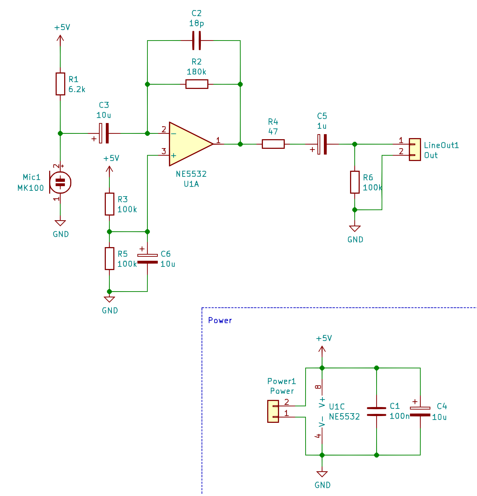
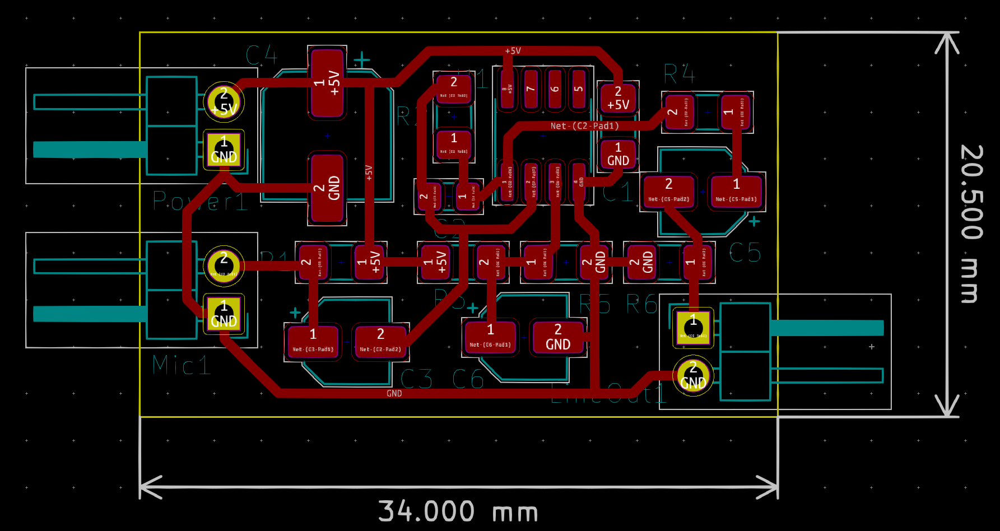

# Electret Microphone Preamp

This design is purely based on [Texas Instruments Single-Supply, Electret Microphone Pre-Amplifier Reference Design by John Caldwell](http://www.ti.com/lit/ug/tidu765/tidu765.pdf?ts=1590780945605)

The Jupyter notebook is basically a interactive Version of that reference design PDF. I claim no copyright on this.

## What you will find here

### Jupyter Notebook

The included Jupyter Notebook is an interactive version of the reference design PDF from Texas instruments. You can
play with all values and let the program re-calculate all relevant values to be used in your own design.

There are some areas that will be most important:

- Operating Voltage of the Preamp

- Parameters of the Microphone capsule in use

- Acceptable high-frequency attenuation

- Acceptable low-frequency cutoff in output highpass filter

- The List of passive component values

- The Op-Amp parameters to look out for

### LT Spice simulation

I have simulated the circuit in LTSpice with some different Op-Amps I had in stock.
I deviated from the `270k` resistor in the Op-Amp feedback loop and opted for a `180k` value. This
means the amplification of the Op-Amp will not reach `0dB` (max. seems to be around `-1.8dB`) but the circuit seems
to run more stable at that amplification.

Here are some bode-plots of the frequency response for some tested Op-Amps:

#### OP07

The OP07 is the worst possible of the bunch. The bad response is a product of the sub-optimal slew rate of .
Additionally this Op-Amp will add noise to the signal as it's input voltage noise is around . Ideally
it should be below  as we can see in the calulations.

#### TL072

The TL072 is a bit better than the OP07. The slew rate of  is at least enough.
This Op-Amp will add a lot of noise to the signal as it's input voltage noise is around . Ideally
it should be below  as we can see in the calulations.

#### NE5532

The NE5532 is really good at this. All parameters are within the parameter range we calculated.

#### LM318

You can see why the LM318 is used for these applications a lot, as it is a dedicated Audio-Op-Amp the response from
this thing is the best of the bunch.

**Attention**: The `LM318` needed `5.3V` operating voltage to actually do anything in the simulation, I have not
verified if this is an artifact of the simulation or an actual problem!

### KiCAD design

The KiCAD design is based on surface mount components to save as much space as possible. You could use tantalum
capacitors instead of the electrolyte I used here, but they are expensive and I don't have them in stock.

The board design is optimized for space and to be single sided as it is easier to prototype this way.
I will probably add a better two sided design in the future which will be optimized for noise performance and
will probably get even smaller (but I have to order the PCBs then)

This is what the board looks like rendered, I will add a photo of the finished product when I have built one.

